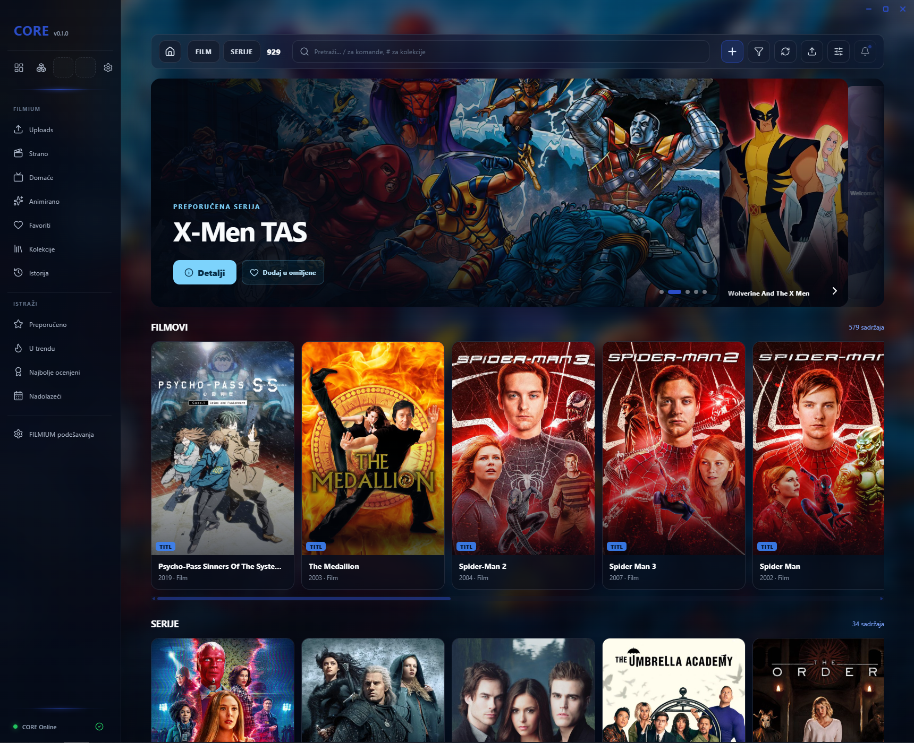
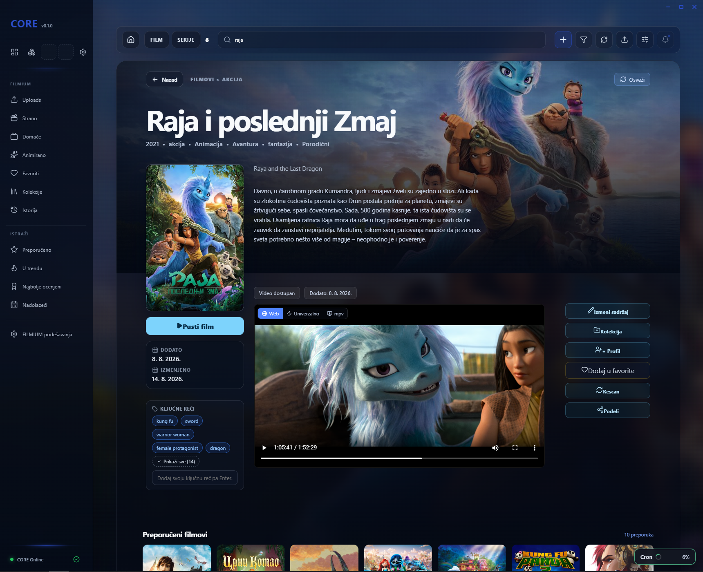
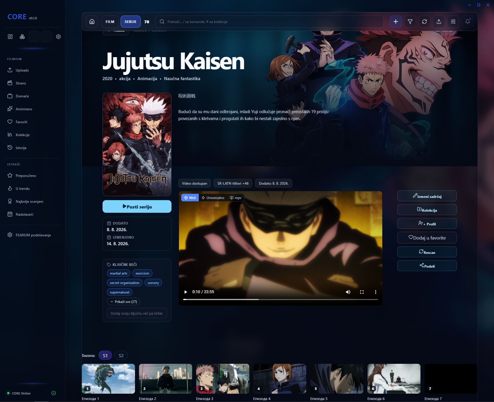
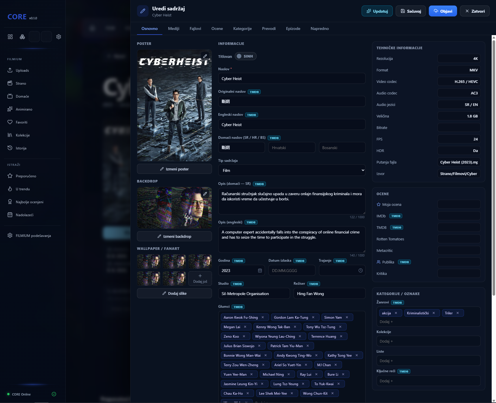
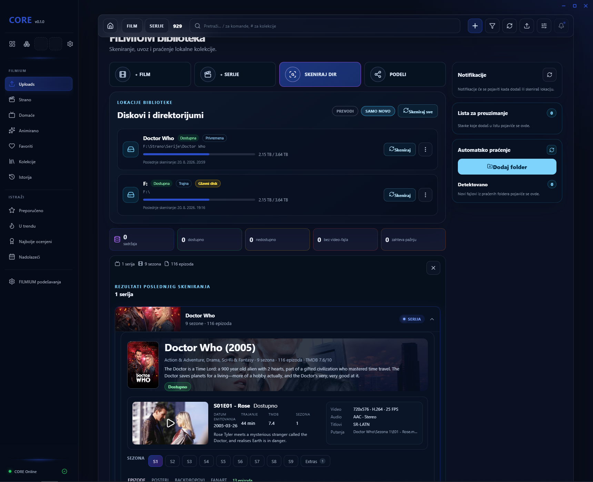
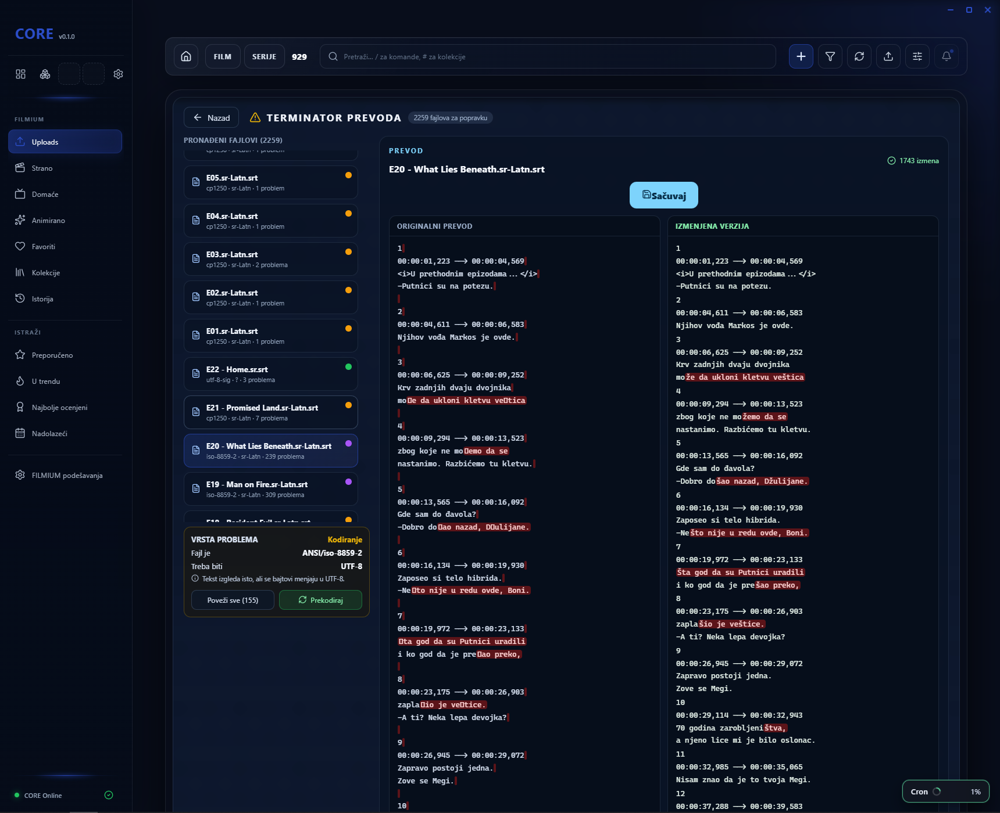
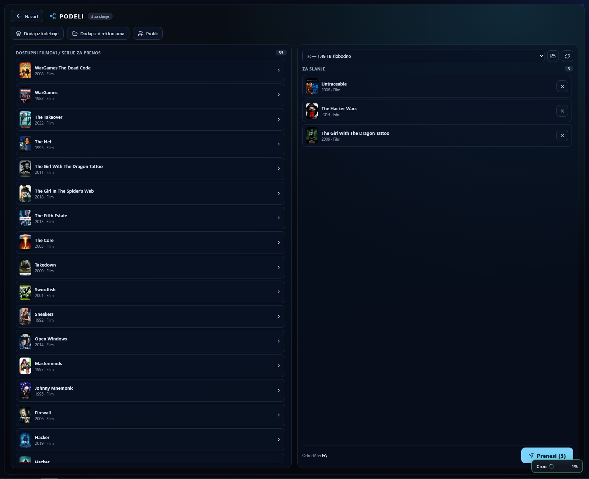
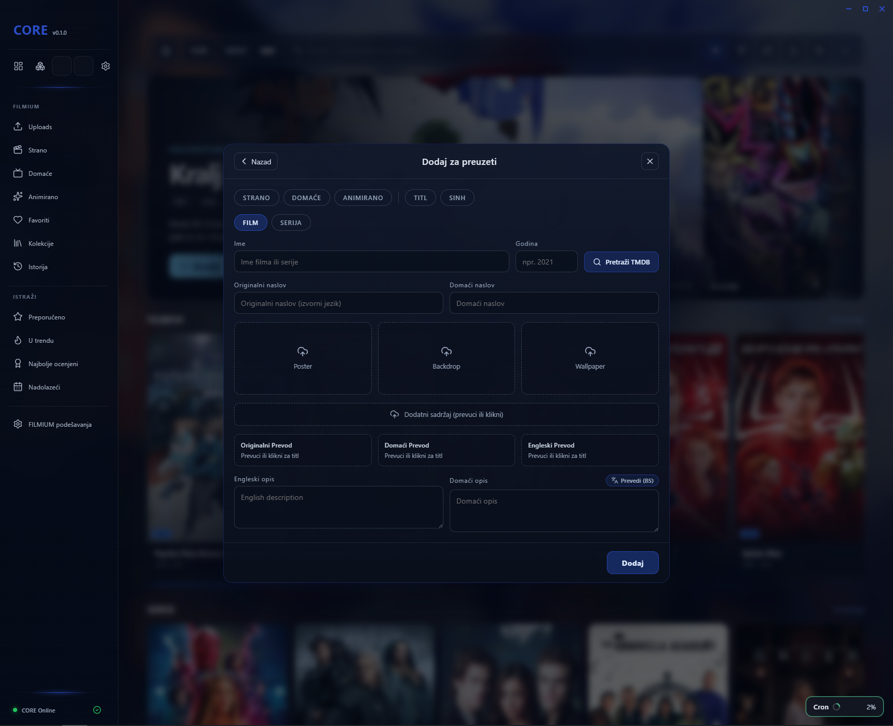

# 📦 FILMIUM Domain

FILMIUM is a highly optimized, smart media management platform built as a detached, autonomous functional domain for the CORE AI OS. It features a plug-and-play architecture that automatically registers with the main CORE system runtime when attached.

## 📸 Interface Preview
*(Place your Dashboard, Video Page, and Subtitle Terminator screenshots here)*

## ⚡ Technical Core & Features

*   🔌 **Plug-and-Play Storage Indexing**: Real-time monitoring and auto-detection of external drives (USB). Automates media discovery and populates metadata dynamically using the TMDB API.
*   📊 **FFmpeg Data Pipeline**: Directly hooks into media containers to extract precise real-time stream diagnostics, codecs, and structural file properties.
*   ✂️ **The Subtitle Terminator (Advanced Parser)**: A custom-built visual editor designed for deep data cleaning. It instantly repairs character encoding (ANSI to UTF-8), fixes timeline/timestamp drifts, strips out malicious script links, and allows mass-filtering of unwanted text elements.
*   🗂️ **Persistent JSON Architecture**: Generates localized structural database maps within media directories to guarantee lightning-fast subsequent directory scans.

## 🛠️ Technology Stack
*   **System Backend**: Tauri (Rust-powered environment for low-level local file-system operations and process execution)
*   **User Interface**: React, TypeScript, Tailwind CSS
*   **Media Processing**: FFmpeg binary integration
---
## 📸 Interface Preview

### 1. Core Dashboard Overview

### 2. Movie Profile Page

### 3. TV Series Explorer

### 4. Content Management System (Edit Section)

### 5. Smart Upload & Driver Scanner

### 6. The Subtitle Terminator (Data Parser & Encoding Repair)

### 7. Core File Share & Sync Manager

### 8. Media Wishlist & TMDB Pre-Staging

---
Developed by [H4K3R0S](https://github.com) as part of the CORE OS Ecosystem.
